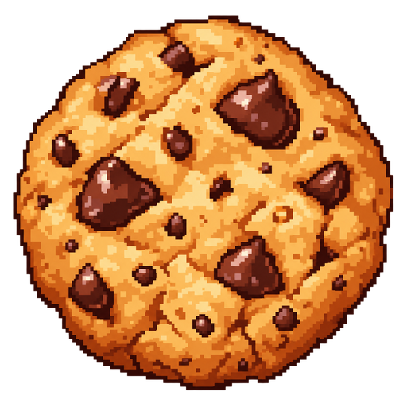

  
  <h1>Cookie Clicker</h1>
  
<strong>Click. Upgrade. Rebirth. Evolve.</strong>

  
Build your cookie empire inside the Cookie House.

  [Play Cookie Clicker on Roblox](https://www.roblox.com/share?code=294d3df91670bd47ae3077d8368436bb&type=ExperienceDetails&stamp=1788797085685)

---

## How to Play

Cookie Clicker is a 3D incremental game set in a cozy bakery. Click your cookie, grow your balance, buy upgrades, and rebirth to become stronger.

1. Click or tap the 3D cookie to earn cookies.
2. Buy **Click Power** to increase the reward from every click.
3. Buy **Auto Ovens** to earn cookies passively.
4. Reach the current rebirth goal.
5. Click the rebirth board to reset temporary upgrades and increase your power.
6. Continue upgrading and evolve your cookie from chocolate chip to golden to cosmic.

Your cookie, effects, HUD, and progression are private to you, while the bakery is shared with other players.

<table>
  <tr>
    <td align="center" width="33%">
      
       <strong>Game icon</strong> Cookie Clicker promotional artwork
    </td>
    <td align="center" width="33%">
      
       <strong>Game thumbnail</strong> Click, bake, upgrade, and expand
    </td>
    <td align="center" width="33%">
      
       <strong>Cookie stand</strong> The 3D cookie station and bakery kiosks
    </td>
  </tr>
  <tr>
    <td align="center">
      
       <strong>3D landscape</strong> The Cookie House and surrounding world
    </td>
    <td align="center">
      
       <strong>Gameplay</strong> Cosmic cookie, HUD, and upgrade board
    </td>
    <td align="center">
      
       <strong>Cookie House</strong> Front exterior view of the bakery
    </td>
  </tr>
  <tr>
    <td align="center">
      
       <strong>Click feedback</strong> Floating cookie reward popup
    </td>
    <td align="center">
      
       <strong>Rebirth</strong> Progress and rebirth requirements
    </td>
    <td align="center">
      
       <strong>Upgrades</strong> Click Power and Auto Oven purchases
    </td>
  </tr>
</table>

## Persistence and Security

- Player progress is saved across sessions with session locking and automatic saves.
- Progress is saved during autosaves, when leaving, and during server shutdown.
- There is no offline-income catch-up.
- Failed loads never overwrite or reset existing progress; the player is asked to rejoin safely.
- Rewards, purchases, rebirths, and balances are calculated and controlled by the server.
- The client sends only an interaction request—it cannot provide its own reward, price, balance, or progression values.
- The server validates the player's save session, life state, distance from the interaction, and click rate.
- Each player's economy and progression are private and are not exposed through public leaderboards.

## Economy

| Rule | Current behavior |
| --- | --- |
| Click value | `(1 + Click Power level) × 2^rebirths` |
| Auto Oven | Adds `2^rebirths` cookies per second |
| Click Power cost | `floor(10 × 1.65^current level)` |
| Auto Oven cost | `floor(25 × 1.7^current level)` |
| Rebirth goal | `100 × 5^current rebirths` cookies |
| Rebirth effect | Keeps overflow, resets Click Power and Ovens, and doubles base scaling |
| Safety limits | 16 rebirths, 50 levels per upgrade, and `9e15` cookies |

Rebirth is **manual**. Earning cookies never resets your progress automatically; activate the rebirth board when the goal is reached. The first goals are 100, 500, 2,500, and 12,500 cookies.

| Rebirth | Cookie tier |
| ---: | --- |
| 0 | Chocolate Chip |
| 1 | Golden Cookie |
| 2+ | Cosmic Cookie |
